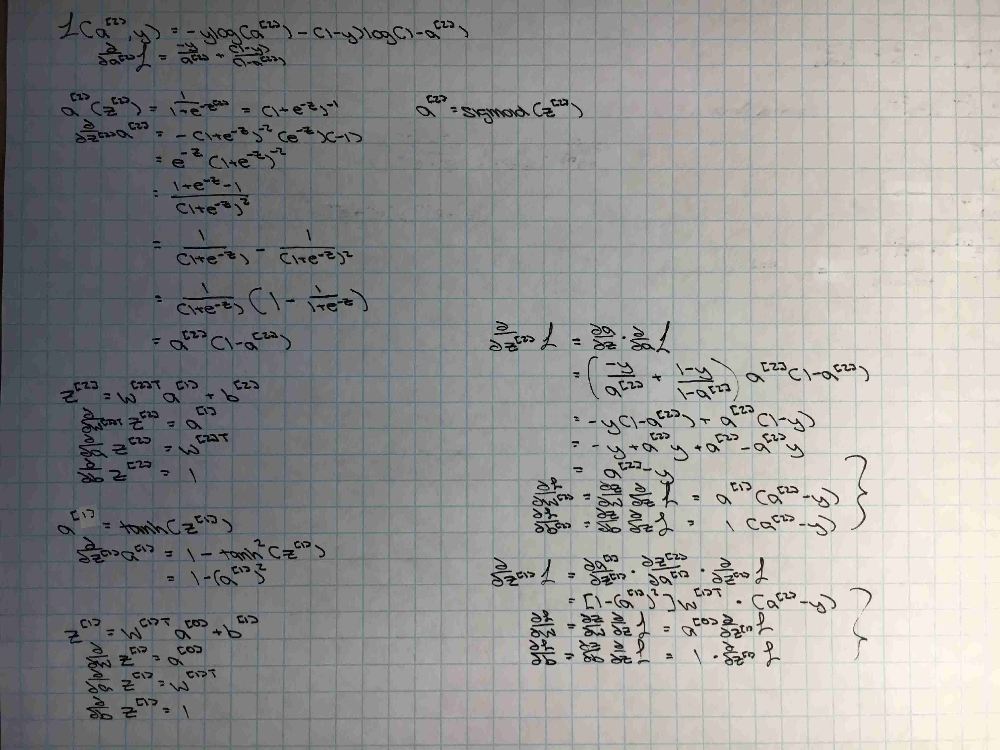

# First Neural Net

**1/2/18** 
- added L2 regularization, still need to cleanup
- fixed roundoff error
- added feature normalization function
- moved away from jupyter notebook

**12/30/18** 
- added ReLU
- recursive forward and back propagation functions
- combined derivative functions for cost function and activation functions
- modularized
- using dictionaries to store majority of data

**12/29/18** 
- not yet functional

**BackProp Derivation (2 Layer NN, logistic loss function)**

